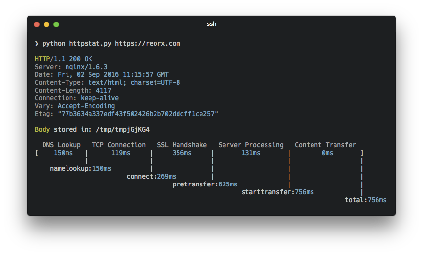
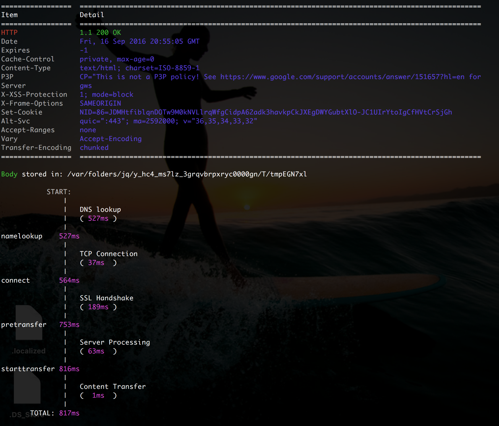

# httpstat_hw_1 was originally cloned from https://github.com/reorx/httpstat. This repository alters the output, as required for Homework 1 of EC601.

httpstat_hw_1 is a **single file🌟** Python script that has **no dependency👏** and is compatible with **Python 3🍻**. We changed the file output from the original:



to THIS (we feel it is much nicer):




## Installation

To get `httpstat_hw_1`:

- Clone the repository from github


## Usage

Just pass a url with it:

```bash
python httpstat.py httpbin.org/get
```

By default it will write response body in a tempfile, but you can let it print out by setting `HTTPSTAT_SHOW_BODY=true`:

```bash
HTTPSTAT_SHOW_BODY=true python httpstat.py httpbin.org/get
```

You can pass any curl supported arguments after the url (except for `-w`, `-D`, `-o`, `-s`, `-S` which are already used by httpstat):

```bash
HTTPSTAT_SHOW_BODY=true python httpstat.py httpbin.org/post -X POST --data-urlencode "a=中文" -v
```
